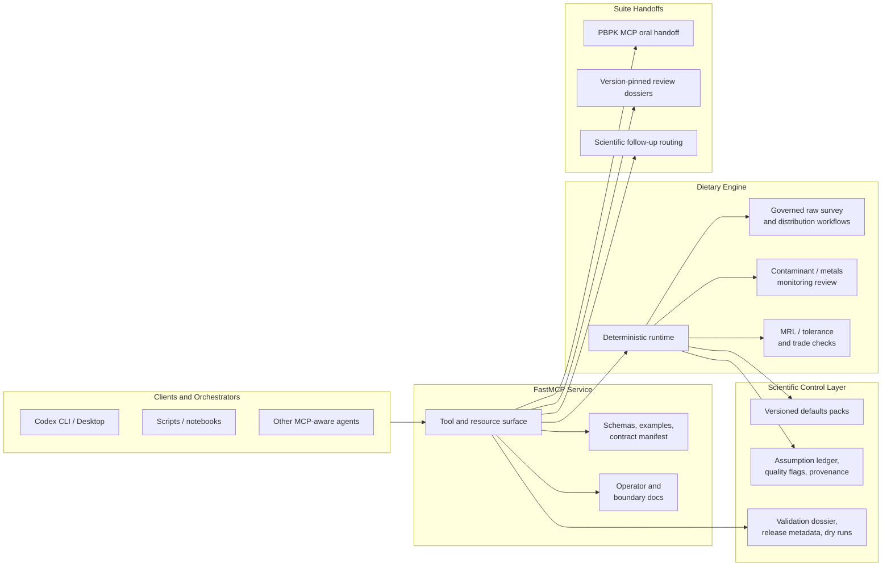

# Dietary Exposure MCP

[](./LICENSE)
[](https://github.com/ToxMCP/dietary-exposure-mcp/releases)
[](./docs/release_readiness.md)
[](https://www.python.org/)

Part of the [ToxMCP suite](https://github.com/ToxMCP/toxmcp).

**MCP server for food-mediated oral exposure screening, governed contaminant and pesticide review, and version-pinned dietary evidence handoffs.**
It turns commodity residue assumptions, governed food-consumption profiles, survey-derived distributions, and monitoring-review evidence into auditable dietary intake summaries, legal-enforcement signals, and PBPK-ready oral dose exports without taking over PBPK execution, final regulatory decisions, or proprietary adapter execution.

The current `v0.1.0-rc1` candidate is prepared for transparent engineering and
scientific review. It is not a final regulatory decision system or a claim of
regulator acceptance. See the [RC release notes](./docs/releases/v0.1.0-rc1.md).

## Architecture



The released server is broader than a simple dietary calculator, but the boundary is still strict:

- `Dietary Exposure MCP` owns food-mediated oral intake, commodity residue inputs, consumption mappings, dietary survey distribution support, contaminant monitoring review, and oral PBPK handoffs.
- `Direct-Use Exposure MCP` owns direct-use oral regimens, tablets, capsules, tinctures, label-driven serving semantics, and administered-use product scenarios.
- `PBPK MCP` owns internal dose / toxicokinetic simulation after an external dose is already defined.
- The server is deterministic-first, with a governed survey distribution lane and cohort-bootstrap probabilistic support; it is not a general-purpose probabilistic or final-decision engine.

For the suite-level routing view, see [docs/suite_integration.md](./docs/suite_integration.md).

## What's in v0.1.0

- Deterministic point-estimate dietary intake scenarios with acute, chronic, and bounded summary support
- Governed raw-survey ingestion plus survey distribution summaries and cohort-bootstrap probabilistic intake support
- Maximum residue limit / tolerance enforcement records and cross-jurisdiction trade-risk screening
- Governed source, method, legal-authority, reporting-profile, occurrence-evidence, and analytical-method-evidence registries
- Contaminant and metals monitoring import checks, interpretation bundles, signoff packets, and version-pinned review dossiers
- Scientific follow-up queue, review-board, owner handoff, remediation, signoff, and owner-signoff dossier workflows
- PBPK-ready oral dose export and ToxClaw dietary evidence bundle support
- Published JSON schemas, examples, defaults manifests, release metadata, validation dossiers, and packaged mirrors

## Release snapshot

The candidate ships schemas, examples, governed defaults, source records,
reference values, consumption profiles, legal and method registries, benchmark
fixtures, and validation dossiers. Counts are intentionally not duplicated in
this README: the machine-readable source of truth is
[release metadata](./docs/releases/v0.1.0.release_metadata.json), with readiness
and validation evidence under [docs/releases/](./docs/releases/).

## Why this project exists

Dietary exposure is often still handled through opaque spreadsheets, partial MRL checks, and scattered reference-value notes. That makes internal review slow and makes regulatory challenge harder to answer.

Dietary Exposure MCP gives the suite a dedicated dietary layer that is:

- **deterministic-first** for auditable Tier 1 and review workflows
- **governed** through versioned defaults, source registries, quality flags, and explicit limitations
- **MCP-native** with typed tools, resources, schemas, examples, and packaged validation assets
- **bounded** so it complements direct-use exposure, PBPK, and review-orchestration services instead of claiming their responsibilities

## Feature snapshot

| Capability | Description |
| --- | --- |
| `🧮 Dietary screening summaries` | Builds deterministic point-estimate and bounded dietary intake summaries from residue profiles and governed consumption profiles. |
| `📚 Survey distribution support` | Parses governed raw survey records, summarizes empirical intake distributions, and runs a bounded bootstrap-style probabilistic support lane with explicit limitations. |
| `⚖️ Enforcement and trade checks` | Applies governed MRL / tolerance records and cross-jurisdiction trade screening before or alongside exposure interpretation. |
| `🧪 Contaminant monitoring review` | Checks monitoring imports, resolves reporting profiles, and exports interpretation, signoff, and review-dossier artifacts for contaminants and metals. |
| `🧾 Provenance and quality flags` | Preserves source references, assumption records, quality flags, and limitation notes as first-class outputs rather than hidden runtime state. |
| `🧭 Readiness and follow-up routing` | Publishes governance-oriented readiness plus machine-readable scientific follow-up queues, owner handoffs, remediation packets, signoff packets, and owner-signoff dossiers with explicit scientific-integrity gates. |
| `🔗 PBPK and evidence handoffs` | Exports PBPK-ready oral input bundles and structured dietary evidence payloads for downstream suite components. |
| `✅ Release and validation surface` | Ships schemas, examples, defaults manifests, release metadata, validation dossiers, dry-run summaries, and packaged parity assets. |

## Release verification

Current validation artifacts report:

- `draft_ready` release status
- all generated validation suites passing
- scientific-invariant, MCP-conformance, schema-drift, packaging, and security gates
- population coverage for `adolescent_11_17`, `adult_general`, `child_1_6`, `older_adult_65_plus`, and `pregnant_adult`

See:

- [docs/releases/v0.1.0.release_metadata.json](./docs/releases/v0.1.0.release_metadata.json)
- [docs/releases/v0.1.0.validation_dossier.json](./docs/releases/v0.1.0.validation_dossier.json)
- [docs/release_readiness.md](./docs/release_readiness.md)

## Quick start

Install the wheel downloaded from the GitHub pre-release:

```bash
uv tool install ./dietary_mcp-0.1.0-py3-none-any.whl
dietary-mcp
```

Or run from a source checkout:

```bash
uv sync --extra dev
uv run dietary-mcp-generate-artifacts
uv run dietary-mcp-validate
uv run dietary-mcp-write-release-reports
uv run pytest
uv run dietary-mcp
```

Artifact generation is an explicit pre-release step; MCP server startup validates and serves the packaged/runtime assets without regenerating checkout files.
The HTTP entrypoint remains loopback-only and fail-closed unless an operator
deliberately configures an authenticated gateway. Public RC support is centered
on local stdio operation.

Optional public-seed generation:

```bash
uv run --with xlrd dietary-mcp-generate-public-seeds --workbook /path/to/gems_food_cluster_diets.xls
```

## Repository layout

- `src/dietary_mcp/`: package code and MCP server surface
- `defaults/v1/`: curated defaults, taxonomy, legal packs, recipes, reporting profiles, and source databases
- `validation/v1/`: benchmark fixtures, reference cases, monitoring checks, and governed validation packs
- `docs/contracts/schemas/`: generated JSON Schema files
- `schemas/examples/`: generated example payloads
- `docs/releases/`: generated release metadata, validation dossiers, and dry-run reports
- `docs/adr/`: architecture decisions
- `tests/`: runtime, defaults, validation, benchmark, and release regression coverage

## Current limitations

- Not a direct-use oral product engine
- Not a PBPK execution engine
- Not a proprietary PRIMo or DEEM execution engine
- Not a general-purpose probabilistic survey engine outside the governed survey workflow
- Not a final regulatory decision engine or a claim of formal equivalence to submission portals

Governed review states are explicit on purpose:

- `signed_off` and `signed_off_with_waivers` mean the configured review workflow has been closed for the current packet; they do not mean automatic regulatory acceptance.
- readiness assessments include scientific-integrity checks, but they still do not replace jurisdiction-specific expert review or grant submission acceptance by themselves.

The detailed limitation and boundary notes are in [docs/applicability_limits.md](./docs/applicability_limits.md) and [docs/dietary_boundary_guide.md](./docs/dietary_boundary_guide.md).

## Contributing

- [CONTRIBUTING.md](./CONTRIBUTING.md) documents the governed change workflow for collaborators.
- Use the scientific-correction issue form for source, unit, population, or interpretation concerns.
- [docs/release_checklist.md](./docs/release_checklist.md) is the pre-push and pre-release checklist.

## Security

Report vulnerabilities through GitHub private vulnerability reporting. Do not
put exploit details, credentials, unpublished dossiers, or local paths in a
public issue. See [SECURITY.md](./SECURITY.md).

## Citation

Citation metadata is available in [CITATION.cff](./CITATION.cff). Scientific
records should also cite the original authority output identified by the
record's provenance, because this software is not the primary scientific source.

## License

Original project code and documentation are licensed under the
[Apache License 2.0](./LICENSE). Third-party scientific data and vendored
materials retain their own terms; see
[THIRD_PARTY_NOTICES.md](./THIRD_PARTY_NOTICES.md).
